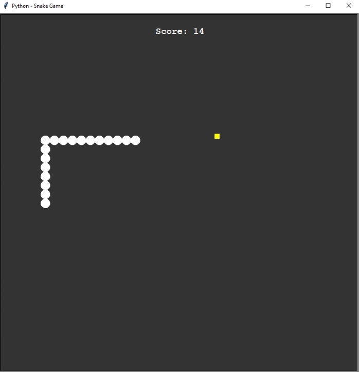

# Snake Game in Python with Turtle Module
## Work in progress

## Overview

For this project, I used the Python Turtle module for graphics and user input handling. This project was also a great opportunity to apply and refine my Object-Oriented Programming (OOP) skills. By embracing OOP principles, the game presents a structured and maintainable codebase, making it simple to make desired changes with no complications.

## How to Play

Use the WASD keys to control the snake's movement.
The snake will move continuously in the direction specified.
The goal is to collect as many food items as possible to increase the snake's length.
The game ends if the snake runs into its own body.
Depending on the game mode, the game also ends if the snake collides with the boundaries of the window; otherwise, it passes through the outer perimeter of the game window and comes back from the opposite side.
